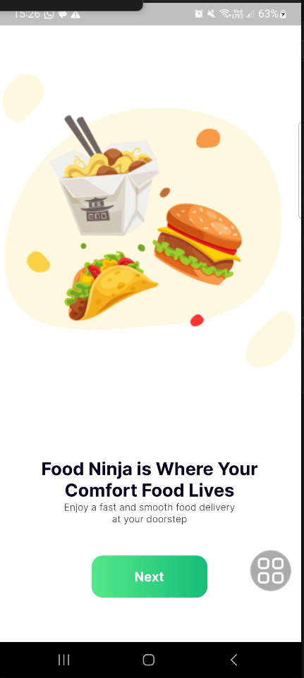
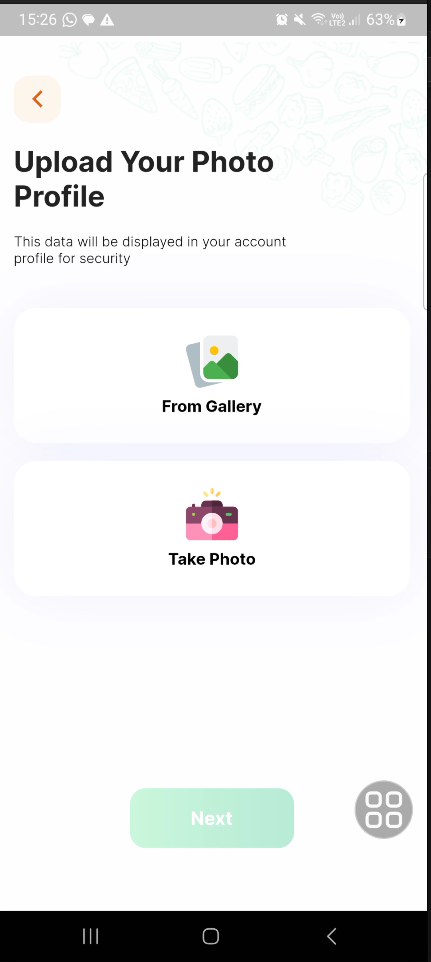

# :pencil2: App de Food com animação

Desenvolvi um aplicativo de comida utilizando o Flutter, com o objetivo de aprimorar minhas habilidades em design de interface e animações. Todas as animações presentes no aplicativo foram criadas exclusivamente com recursos nativos do Flutter, sem a utilização de pacotes externos.

[]

## :heavy_check_mark: Telas do projeto

## 

## 

## :computer: Tecnologias, APIs, Packages utilizados:
      
  * Flutter / Dart
  * flutter_svg
  * image_picker
  * google_fonts
  * get_it
  * geolocator
  * hive
  * path_provider
  * mask_text_input_formatter

